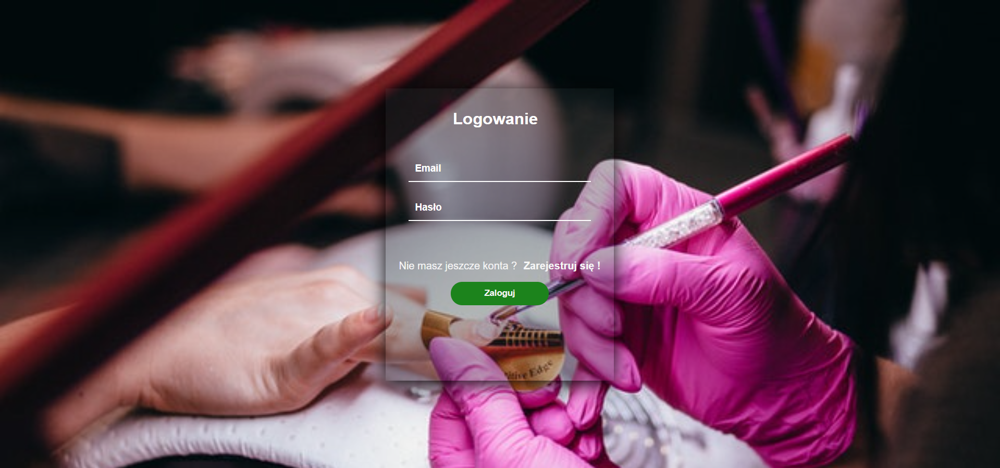
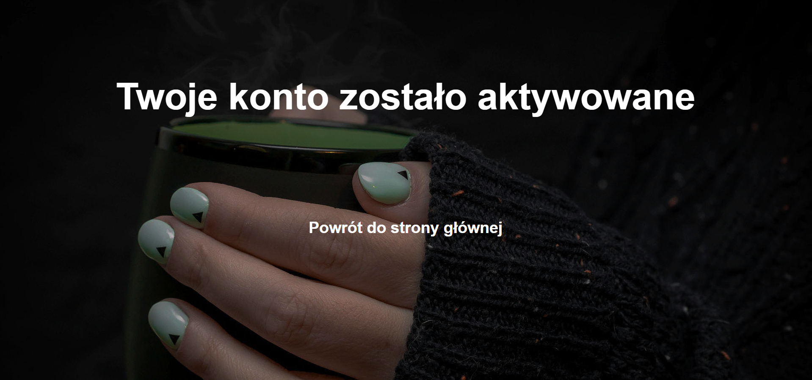
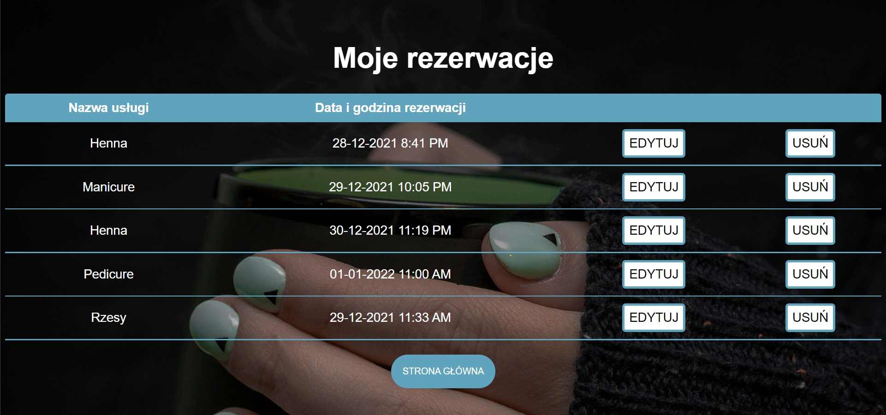
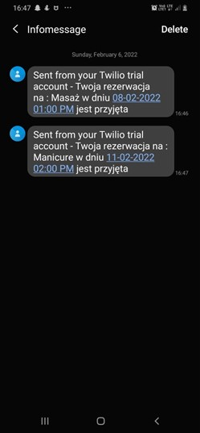
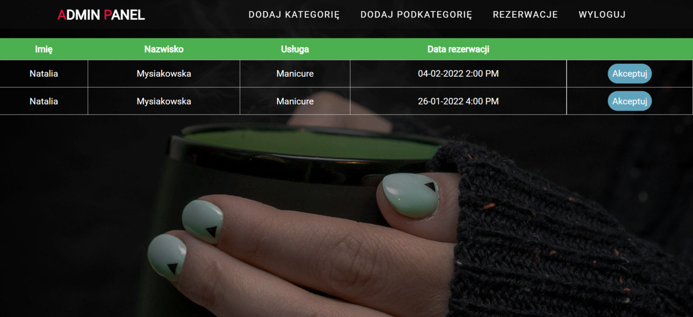

# Reservation System

### The application is designed to register customers for cosmetic services.

# System functionality
### User account
- User registration
- Profile editing
- Booking of services
- Editing services reservation
- Confirmation of services via SMS and email

### Admin account

- Acceptance of reservation
- Ability to add new services and sub-services
- Preview of reservations which are awaiting approval
- The admin will receive emails when a user wants to make a reservation or change a reservation

# Technologies

- Java 17
- Spring (Boot, JPA, Security, Web)
- Hibernate
- SQL
- Java Mail Library
- HTML
- CSS
- Thymeleaf
- JUnit 5
- Mockito
- Twilio

# To do list

- [X] Created repo
- [X] Created application skeleton
- [X] Created and connect with database
- [X] Created user entity
- [X] Created category entity
- [X] Created role entity
- [X] Created sub category entity
- [X] Created reservation entity
- [X] Created controller
- [X] Created repository
- [X] Created service
- [x] Created main view
- [x] Created login view
- [x] Created registry view
- [x] Created reservation list view
- [x] Created my reservation view
- [x] Created admin panel
- [x] Created reservation view
- [x] Send SMS with Twilio 
# Preview

<h1 align="center">Main view</h1>

<h1 align="center">Registry view</h1>

<h1 align="center">Login view</h1>

<h1 align="center">Confirm email</h1>

<h1 align="center">Success confirm email</h1>

<h1 align="center">Reservation view</h1>

<h1 align="center">User reservation</h1>

<h1 align="center">SMS booking acceptance</h1>

<h1 align="center">Admin panel - reservation</h1>

